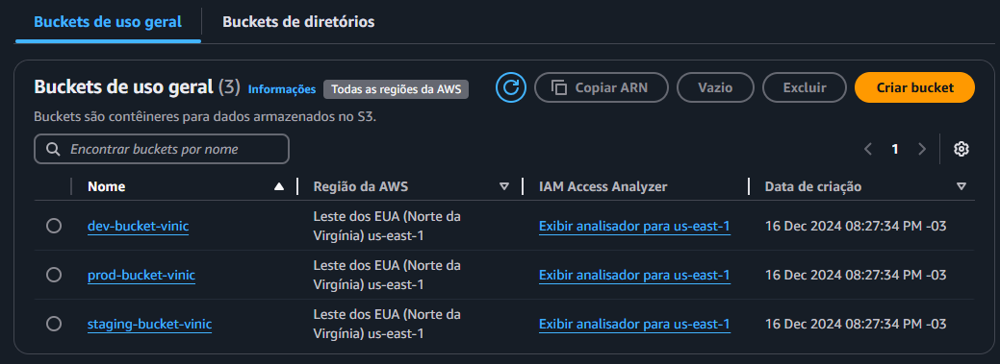

# Cenário Simulado: Configuração de Bucket S3 para ambientes de Produção/Homologação/Desenvolvimento

Nesse momento estou aprendendo a fazer a estruturação de pastas usando os modules e aprendendo a usar as variaveis do Terraform

## Simulação: Configuração Multi-Ambiente com Terraform
### Caso de Simulação
Você trabalha em uma empresa chamada Logify, que está implementando uma infraestrutura baseada na nuvem. O time de DevOps quer organizar os recursos da AWS para diferentes ambientes: desenvolvimento (dev), homologação (staging) e produção (prod). Cada ambiente precisa ter sua configuração, mas o objetivo é evitar duplicação de código e manter boas práticas.

### Requisitos do Desafio
1. Buckets S3 Separados por Ambiente:

* Cada ambiente deve ter seu bucket S3 com configurações consistentes:
* Nome único: deve incluir o ambiente no nome do bucket.
* Versionamento habilitado.
* Bloqueio de acesso público ativado.
* ACL configurada como privada.
* Tags específicas para identificar o ambiente (dev, staging, prod).

2. Organização do Código:

* Use variáveis para configurar o nome do bucket e as tags de forma dinâmica.
* Organize o código para que um único recurso S3 possa ser usado para todos os ambientes.
* Certifique-se de que o código seja reutilizável e escalável para adicionar novos ambientes no futuro.

3. Ambientes Especificados no Terraform:

* Crie uma variável chamada environment, que será usada para identificar o ambiente (ex.: dev, staging, prod).
* Use essa variável para ajustar o nome dos buckets e as tags dinamicamente.

4. Controle de Propriedade:

*  Adicione controle de propriedade para garantir que o proprietário do bucket tenha controle total sobre os objetos enviados.

5. Segurança e Boas Práticas:

* Nenhum bucket deve ter acesso público habilitado.
* Todos os buckets devem estar privados.

### Objetivo
* Seu objetivo é configurar e aplicar o Terraform para criar os buckets S3 nos ambientes dev, staging e prod, seguindo os requisitos acima. 

Além disso, você deve:

* Garantir que o código seja organizado e reutilizável.
* Verificar e validar o código com o Terraform antes de aplicar.

## Resultado Final
